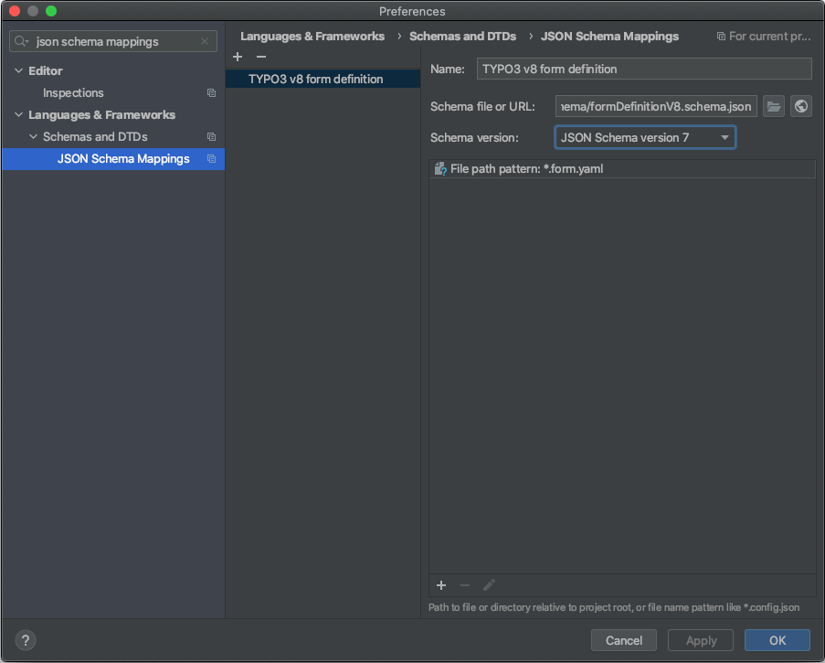

# TYPO3 Form Schema
JSON Schema for TYPO3 Form

See: https://www.schemastore.org/json/

## Create a new JSON Schema Mapping for *.form.yaml files in PhpStorm

1.  Use `https://raw.githubusercontent.com/t3easy/TYPO3-Form-Schema/main/formDefinitionV8.schema.json` as URL
    or download the file.
1.  Add a `File path pattern` with the value `*.form.yaml`